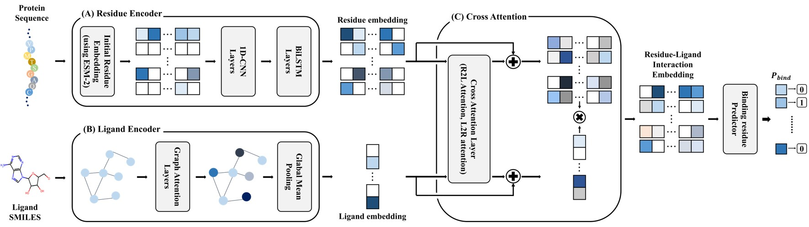

# LiBRe
> LiBRe (**Li**gand-aware **B**inding **Re**sidue Predictor) is a ligand-aware sequence-based binding residue prediction model that explicitly incorporates both residue-level information from protein sequences and ligand information.

## 🖼 Model Architecture

