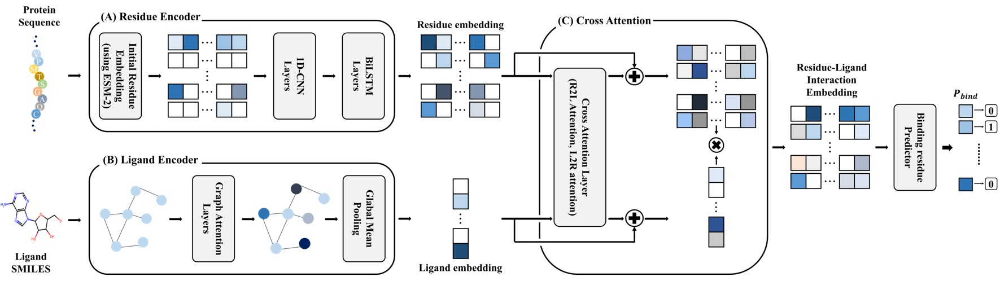

# LiBRe
> LiBRe (**Li**gand-aware **B**inding **Re**sidue Predictor) is a ligand-aware sequence-based binding residue prediction model that explicitly incorporates both residue-level information from protein sequences and ligand information.

## 🖼 Model Architecture



## 🧩 Dependencies
- Python >= 3.8
- PyTorch >= 1.12
- numpy
- pandas
- RDKit

## 🚀 How to Use LiBRe

LiBRe requires protein residue embeddings and ligand features as inputs.  
Follow the steps below to prepare the required files and run the model.

---

### 1. Generate Protein Residue Embeddings

Protein residue-level embeddings are generated from protein sequences using a pretrained ESM model.

```bash
python3 data/residue_embedding.py \
  --csv_path ./data/train/train_example.csv
```

This command generates a residue-level protein embedding file (`.pt`) in the same directory as the input CSV file.

### 2. Generate Ligand Features from SMILES

Ligand graph features are generated from SMILES strings using RDKit and converted into PyTorch Geometric graph representations.

```bash
python3 data/ligand_featurizer.py \
  --csv_path ./data/train/train_example.csv
```

This command generates a ligand feature file (`_ligand.pkl`) in the same directory as the input CSV file.

### 3. Train

Train the model using the precomputed residue embeddings (.pt) and ligand features (_ligand.pkl).

```bash
python3 train.py \
  --train_csv ./data/train/train_example.csv \
  --train_emb ./data/train/train_example.pt \
  --train_ligand ./data/train/train_example_ligand.pkl \
  --test_csv ./data/test/test_example.csv \
  --test_emb ./data/test/test_example.pt \
  --test_ligand ./data/test/test_example_ligand.pkl \
  --seed 42
```

## ▶️ Run LiBRe

Use a trained LiBRe model to predict ligand-binding residues given a protein sequence and a ligand SMILES string.

```bash
python3 run.py

```
